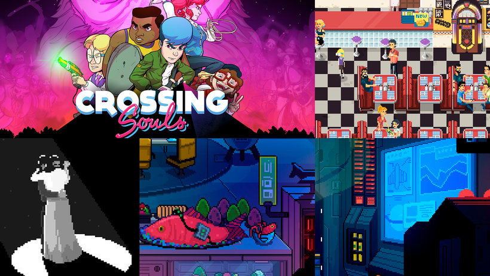

# Introducción al diseño de personajes en pixel art

Crea desde cero personajes para videojuegos en los que el píxel es el protagonista

Un píxel es la mínima expresión digital de un color y el pixel art es una forma de arte digital que consiste en editar imágenes a nivel del píxel para conseguir una estética old school, como en los videojuegos antiguos.

En este curso aprenderás a replicar esta estética de la mano de Daniel Benítez —cofundador del estudio de videojuegos Fourattic— quien te enseñará a dominar el arte del píxel desde cero, para crear personajes y gráficos para videojuegos en 2D de última generación, usando el software Pyxel Edit. 

